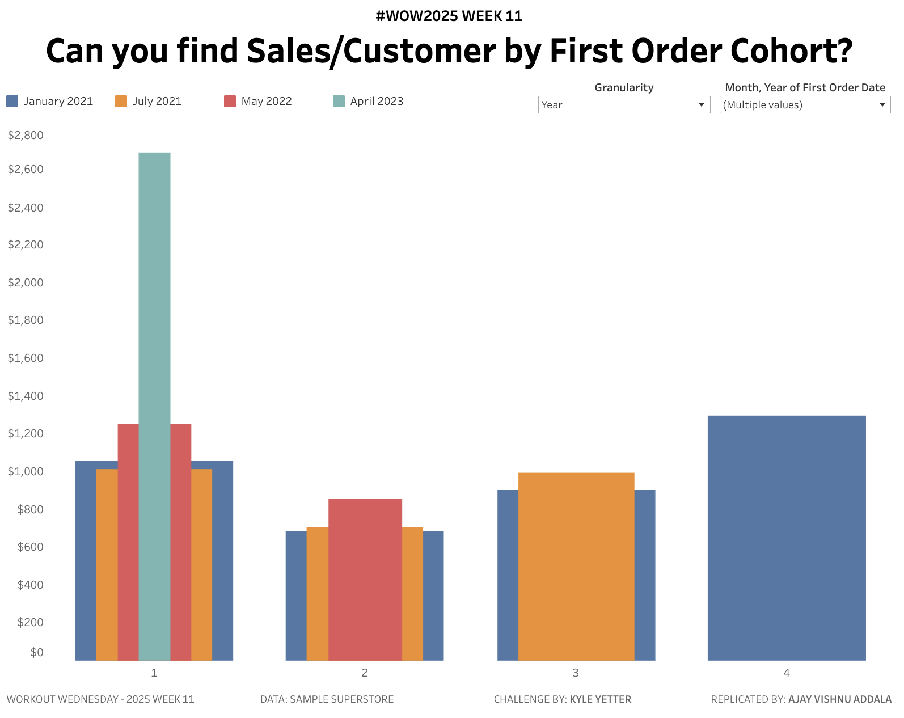

# Sales per Customer by First Purchase Cohort | #WOW2025 Week 11

Cohort analysis is a great way to explore patterns in customer spending behavior. This Tableau dashboard focuses on cohorts defined by the **first purchase date** and visualizes **sales per customer** over time. It allows users to interactively analyze trends and compare performance across cohorts.

## Dashboard Features

1. **Cohort Analysis**: View sales per customer based on first purchase cohorts.
2. **Time Granularity**: Toggle between **months** or **years** since the first purchase date.
3. **Dynamic Filtering**: Select and compare 3-4 cohorts (e.g., Jan 2021, May 2021, Jun 2022, Nov 2023).
4. **Data Completeness**: For yearly views, only fully completed years are displayed.
5. **Custom Color Palette**: Consistent and contrasting colors for up to 4 cohorts.

## Requirements

- **Dimensions**:
  - First Purchase Date Cohort
  - Order Date
- **Metrics**:
  - Sales per Customer
  - Months Since First Purchase
  - Years Since First Purchase (Derived)
- **Filters**:
  - Cohort Selection (3-4 cohorts)
  - Toggle between Months and Years

## Snapshot

## Live Dashboard

[View the Tableau Dashboard on Tableau Public](https://public.tableau.com/shared/8Q4M8GK72?:display_count=n&:origin=viz_share_link)

## Instructions for Analysis

1. **Cohort Selection**: Use the filter to select up to 4 first purchase cohorts.
2. **Toggle View**: Use the control to switch between months or years since purchase.
3. **Interpret Trends**:
   - Look for trends in customer spending over time.
   - Identify cohorts with consistent or declining spending habits.

## Insights

- **Spending Trends**: Do certain cohorts consistently spend more?
- **Retention Analysis**: Are there differences in long-term spending between cohorts?
- **Strategy Optimization**: Use insights to optimize marketing and retention strategies for specific cohorts.

## Technical Notes

- **Data Source**: Superstore data
- **Tableau Version**: 2023.3
- **Custom Calculations**:
  - Months Since First Purchase: `DATEDIFF('month', [First Purchase Date], [Order Date])`
  - Years Since First Purchase: `DATEDIFF('year', [First Purchase Date], [Order Date])`
  - Sales per Customer: `[Sales] / COUNTD([Customer ID])`

